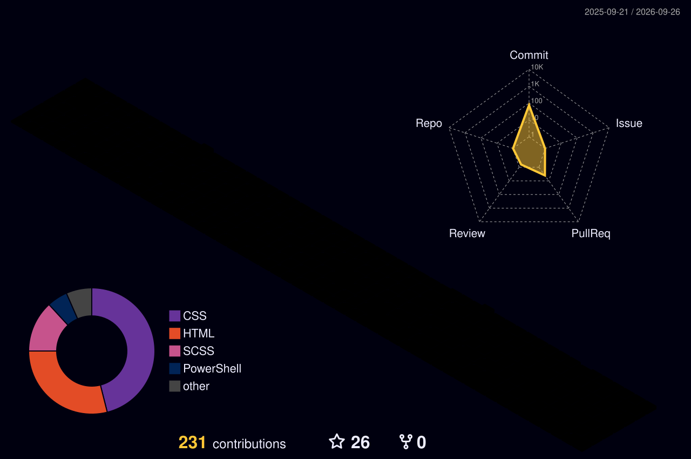

# Hi there, I'm Pascal - aka [Wolfÿ][youtube] 👋

[][discord]
[][website]
[][steam]
[][youtube]
[][twitch]
[][instagram]
[][twitter-sub]
[][spotify]

## 💻 Moods~

- 👾 Writing code like I play games: aggressively, and with snacks!
- 📦 "Temporary fix" veteran. Still running strong 2 weeks later
- 🧼 Clean code? I prefer "functional chaos"-
- 💬 If it compiles, I commit. If it doesn’t... I scream internally...
- 🧪 Currently cooking: something broken but cool!
- 🌐 Building websites no one asked for but everyone secretly vibes with!
- 💿 Yes I own a website. No I don’t know what to do with it.
- 💽 I break it so I can fix it better.

---

### 📺 Latest YouTube Videos

<!-- YOUTUBE:START -->
- [ReviveTanki – A homage to the official Tanki X](https://www.youtube.com/watch?v=MksHtY5TZe8)
- [ReviveTanki | How to download / play! | Как скачать и играть! &lpar;русские субтитры&rpar;](https://www.youtube.com/watch?v=XQh4FMQqeu4)
- [Destiny 2 Tutorial | x Kills Quests](https://www.youtube.com/watch?v=xVMb2wdE0do)
- [ΛVΛRIΛ - Destiny 2 Community with Archives, Guides and more!](https://www.youtube.com/watch?v=Q3XIGciTToI)
- [Destiny 2 - Void Bouncer #BuildOfTheWeek](https://www.youtube.com/watch?v=PZYJtw64iBo)
<!-- YOUTUBE:END -->

➡️ [more videos...](https://youtube.com/mewpasco)

---

### :fire: GitHub Stats

### 📜 Own Website Project

### 💎 Some Discord CSS Projects | Vencord

---

### 🗣️ 3D Overview

[website]: https://avariaxyz.win/
[steam]: https://steamcommunity.com/id/mewpasco/
[twitter-sub]: https://x.com/intent/follow?original_referer=https%3A%2F%2Fgithub.com%2Fmewpasco&screen_name=mewpasco
[youtube]: https://youtube.com/mewpasco
[instagram]: https://instagram.com/mewpasco
[discord]: https://discord.gg/avia
[twitch]: https://twitch.tv/mewpasco
[spotify]: https://open.spotify.com/user/21jfhcbrbqznxwafykqahzt6y?si=0f69433fb1724618
